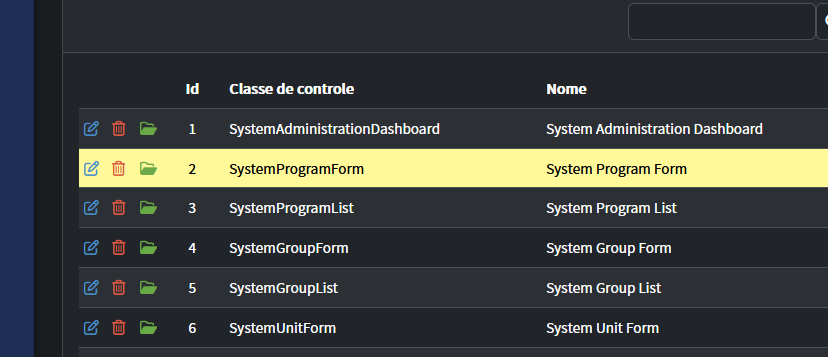
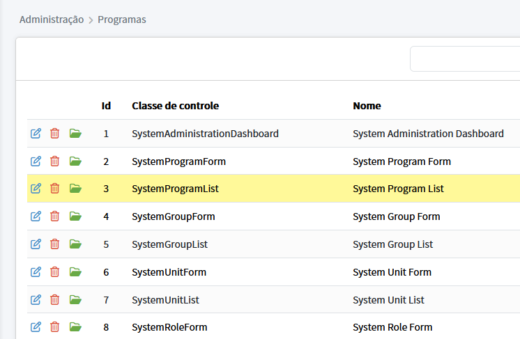
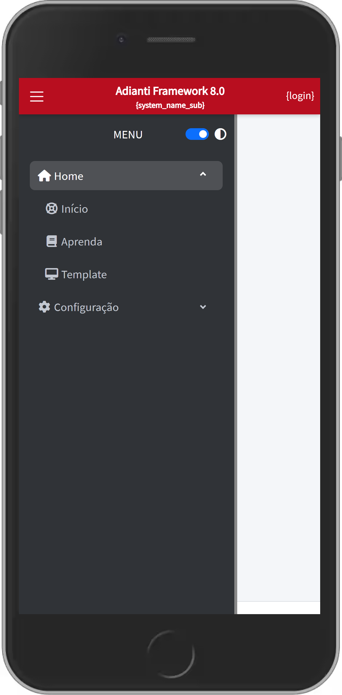
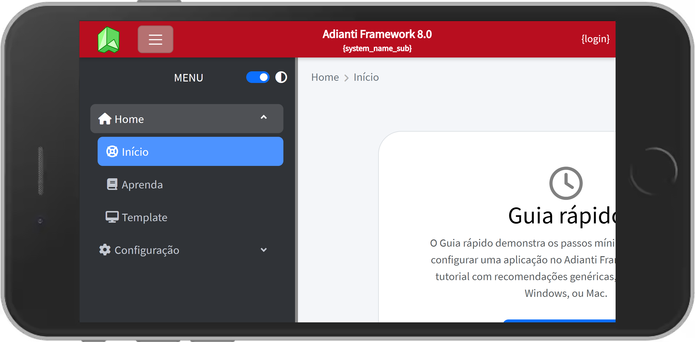
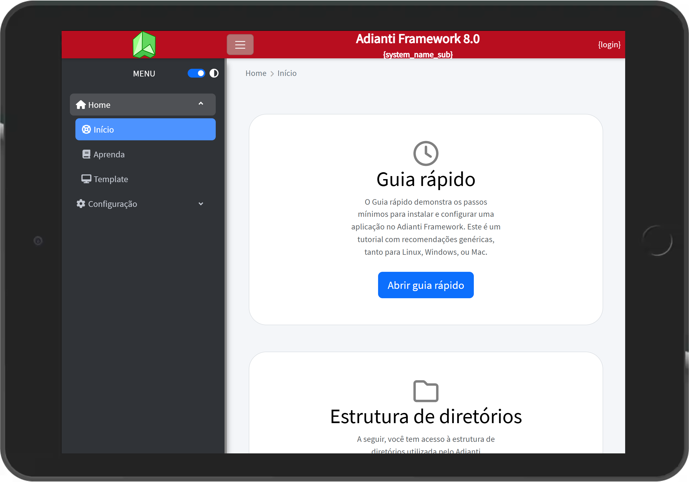

# Temas para o FrameWork Puro
* [<- voltar para lista de temas BootStrap](../framework_puro.md)
* [<- voltar para index](../../README.md)


Temas para apresentação do FrameWork Puro [Adianti 8.0.0](https://adiantiframework.com.br/)

# Melhorias

*Quais são as diferenças do tema padrão ?*

## Barra fixa


## Zoom no celular
Removendo `maximum-scale=1, user-scalable=no` - Sem esse parâmetro no celular o usuário consegue fazer o movimento de pinça para aumentar ou diminuir o zoom, o que aumenta acessebilidade para os usuários. Abaixo de lista de arquivos:
1. Arquivo: `layout.html`
1. Arquivo: `login.html`

## Outras melhorias
1. [Bug versão manifest](https://github.com/bjverde/adianti-theme/issues/32)
1. Permitir scalable
1. Houver grid amarelo
1. Permite selecionar Label


# Mudanças visual
Tema escuro houver com amarelo




Tema claro houver com amarelo




# Como instalar o tema adminbs5_t
1. copie a pasta pasta `adminbs5_t` dentro de adianti template cole em `<SISTEMA>/app/templates`
1. Excute as partes abaixo

## Parte 01 
Editar o arquivo `<SISTEMA>/app/config/application.php`

### alterar o tema padrão
altere o valor `theme = <NOME ATUAL>` para `theme = adminbs5_t`

### incluindo seção system 
Incluir uma nova seção com as informações abaixo

```ini
    'system' => [
        'system_version' => '2.0.0'
    ],
```

## Parte 02
Edite o arquivo `<SISTEMA>/app/lib/menu/AdiantiMenuBuilder.php` alterando nas linhas
```php
            case 'adminbs5':
                $xml  = new SimpleXMLElement(file_get_contents($file));
```

incluido adminbs5_t logo abaixo adminbs5, ficando como o exemplo abaixo
```php
            case 'adminbs5':
            case 'adminbs5_t':
                $xml  = new SimpleXMLElement(file_get_contents($file));
```

## Parte 03
Edite o arquivo `<SISTEMA>/index.php` incluido as linhas abaixo:
```php
$content     = file_get_contents("app/templates/{$theme}/layout.html");
$menu_string = AdiantiMenuBuilder::parse('menu.xml', $theme);
$content     = ApplicationTranslator::translateTemplate($content);
$content     = str_replace('{LIBRARIES}', file_get_contents("app/templates/{$theme}/libraries.html"), $content);
$content     = str_replace('{class}', isset($_REQUEST['class']) ? $_REQUEST['class'] : '', $content);
$content     = str_replace('{template}', $theme, $content);
$content     = str_replace('{MENU}', $menu_string, $content);
$content     = str_replace('{MENUTOP}', AdiantiMenuBuilder::parseNavBar('menu-top-public.xml', $theme), $content);
$content     = str_replace('{MENUBOTTOM}', AdiantiMenuBuilder::parseNavBar('menu-bottom-public.xml', $theme), $content);
$content     = str_replace('{lang}', $ini['general']['language'], $content);
$content     = str_replace('{title}', $ini['general']['title'] ?? '', $content);
$content     = str_replace('{template_options}',  json_encode($ini['template'] ?? []), $content);
$content     = str_replace('{adianti_options}',  json_encode($ini['general']), $content);

//--------------- adminbs5_t -----------------------
$content     = str_replace('{system_name_sub}', $ini['general']['system_name_sub'] ?? '', $content);
$content     = str_replace('{login}','usuario.logado', $content); //Aqui informe seu metodo de login
//--------------- FIM adminbs5_t ------------------


$css         = TPage::getLoadedCSS();
$js          = TPage::getLoadedJS();
$content     = str_replace('{HEAD}', $css.$js, $content);

echo $content;
```
# Exemplo do sistema tema rodando





