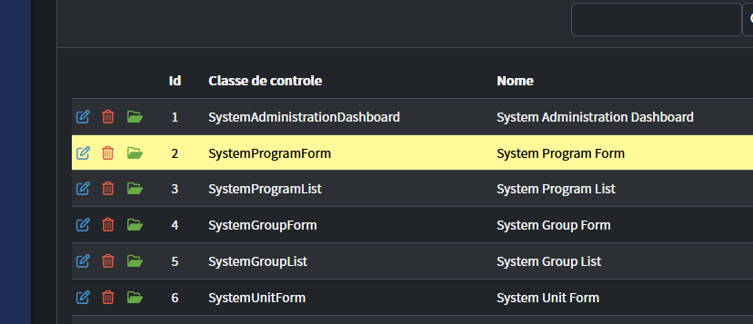
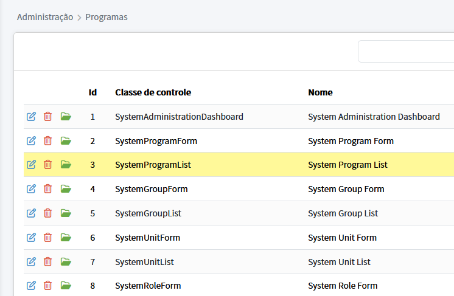

# Temas para o Template
* [<- voltar para lista de temas BootStrap](../template.md)
* [<- voltar para index](../../README.md)


Temas para apresentação do template [Adianti FrameWork 8.4.0](https://adiantiframework.com.br/)

# Melhorias

*Quais são as diferenças do tema padrão ?*

## Zoom no celular
Removendo `maximum-scale=1, user-scalable=no` - Sem esse parâmetro no celular o usuário consegue fazer o movimento de pinça para aumentar ou diminuir o zoom, o que aumenta acessebilidade para os usuários. Abaixo de lista de arquivos:
1. Arquivo: `iframe.html`
1. Arquivo: `layout.html`
1. Arquivo: `login.html`

## Outras melhorias
1. Bug manifest version
1. Houver no grid com amarelo
1. Possibilitar selecionar label do campo
1. Incluir barra sobre titulo
1. Incluir versão do sistema


# Mudanças visual
Tema escuro houver com amarelo




Tema claro houver com amarelo




# Como instalar o tema adminbs5_v6
1. copie a pasta pasta `adminbs5_v6` dentro de adianti template cole em `<SISTEMA>/app/templates`
1. Excute as partes abaixo

## Parte 01 
Editar o arquivo `<SISTEMA>/app/config/application.php`

### alterar o tema padrão
altere o valor `theme = <NOME ATUAL>` para `theme = adminbs5_v6`

### incluindo seção system 
Incluir uma nova seção com as informações abaixo

```ini
    'system' =>  [
        'system_version' => '1.0.0',
        'system_name_sub'=> 'Fork do Adianti FrameWork',
        'adianti_min_version'=> '8.4.0',
        'formdin_min_version'=> '5.9.0',
    ],
```
Explicando os novos parâmetros:
* system_version - é versão do seu sistema
* system_name_sub - subtitulo do sistema, depende de alterar o layout para aparecer
* adianti_min_version - versão mínima do Adianti Framework que o sistema precisa
* formdin_min_version - versão mínima do FormDin que o sistema precisa

## Parte 02
Edite o arquivo `<SISTEMA>/app/lib/menu/AdiantiMenuBuilder.php` alterando nas linhas
```php
        if ($theme == 'adminbs5')
        {
            $xml  = new SimpleXMLElement(file_get_contents($file));
            $menu = new TMenu($xml, self::CHECK_PERMISSION, 1, 'sidebar-dropdown list-unstyled collapse', 'sidebar-item', 'sidebar-link collapsed', [__class__, 'prepareItem']);
```

incluido adminbs5_v6 logo abaixo adminbs5, ficando como o exemplo abaixo
```php
        $listTemas = array('adminbs5', 'adminbs5_v6');
        if ( in_array($theme, $listTemas) ) {
            $xml  = new SimpleXMLElement(file_get_contents($file));
            $menu = new TMenu($xml, self::CHECK_PERMISSION, 1, 'sidebar-dropdown list-unstyled collapse', 'sidebar-item', 'sidebar-link collapsed', [__class__, 'prepareItem']);
```

## Parte 03
Edite o arquivo `<SISTEMA>/index.php` altere de 

```php
$content = ApplicationTranslator::translateTemplate($content);
$content = AdiantiTemplateParser::parse($content);
```

PARA

```php
//--- START: TEMA ADMINBS5_V6  ---------------------------------------------------------
$system_version = $ini['system']['system_version'];
$title       = $ini['general']['title'];
$head_title  = $title.' - v'.$system_version;

$content = str_replace('{head_title}', $head_title, $content);
$content = str_replace('{title}', $title, $content);
$content = str_replace('{system_version}', $system_version, $content);
//--- END: TEMA ADMINBS5_V6 ------------------------------------------------------------

$content = ApplicationTranslator::translateTemplate($content);
$content = AdiantiTemplateParser::parse($content);
```