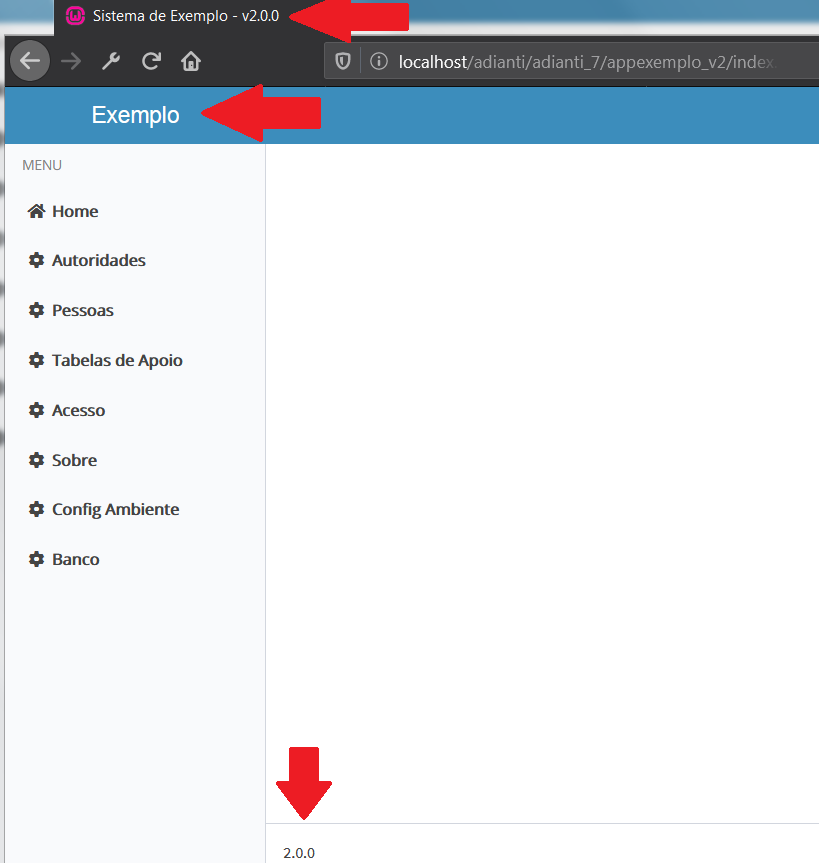

# Temas para o FrameWork Puro
Temas para apresentação do [Adianti FrameWork 7.5.1b](https://www.adianti.com.br/) baseado na aparecem padrão d BootStrap

* [<- voltar para lista de temas BootStrap](../framework_puro.md)
* [<- voltar para index](../../README.md)


# theme4_v5

## *Quais são as diferenças do theme 4 do Adianti ?*
* retirada do `maximum-scale=1, user-scalable=no` da `viewport` no arquivo layout.html. Sem esse parâmetro no celular o usuário consegue fazer o movimento de pinça para aumentar ou diminuir o zoom , o que aumenta acessebilidade para os usuários.
* Inclusão dos arquivos das fontes MaterialIcons e source-code-pro assim não precisa de internet para baixar as fontes.
* Inclusão do nome do sistema de forma customizada `{logo-lg}` ou `{logo-mini}` no `application.ini`.
* Inclusão da versão do sistema `{system_version}` de forma customizada no `application.ini`.
* Title do HEAD alterado conforme novos parametos `{head_title}` e `{system_version}` no `application.ini`.
* Arquivo de `libraries.html` conforme Adianti 7.5.1b
* Arquivo favicon.png
* Arquivo de `layout.html` alterado removendo `layout-boxed` para ocupar toda area

## Telas e suas alterações
Locais das alterações


### Origem das fontes MaterialIcons
* MaterialIcons - https://github.com/google/material-design-icons/releases
* source-code-pro - https://github.com/adobe-fonts/source-code-pro
* Artigo do StackOverFlow que ajudou corrigir os temas - https://stackoverflow.com/questions/37270835/how-to-host-material-icons-offline


## Para usar o theme4_v5
1. copie a pasta pasta `theme4_v5` dentro de framework_puro cole em `<SISTEMA>/app/templates`
1. Excute as partes abaixo

### Parte 01 
Editar o arquivo `<SISTEMA>/app/config/application.ini`

#### alterar o tema padrão
altere o valor `theme = <NOME ATUAL>` para `theme = theme4_v5`

#### incluindo seção system 
Incluir uma nova seção com as informações abaixo
```ini
[system]
system_version = 2.0.0
head_title = Sistema de Exemplo
logo-lg = Exemplo
logo-link-class = 'SystemAboutView'
login-link = http://wwww.meusite.com.br
```

### Parte 02

Edite o arquivo `<SISTEMA>/app/lib/menu/AdiantiMenuBuilder.php`. 

Depois altere no  
```php
$menu->style = 'overflow: hidden; width: auto; height: 390px;';
```

para
```php
$menu->style = 'overflow: hidden; width: auto;';
```

### Parte 03
Edite o arquivo `<SISTEMA>/index.php` incluido as linhas abaixo:

```php
$system_version = $ini['system']['version'];
$head_title  = $ini['system']['head_title'].' - v'.$system_version;
$content     = str_replace('{head_title}', $head_title, $content);
$content     = str_replace('{system_version}', $system_version, $content);
$content     = str_replace('{logo-mini}', $ini['general']['application'], $content);
$content     = str_replace('{logo-lg}', $ini['system']['logo-lg'], $content);
$content     = str_replace('{logo-link-class}', $ini['system']['logo-link-class'], $content);
```