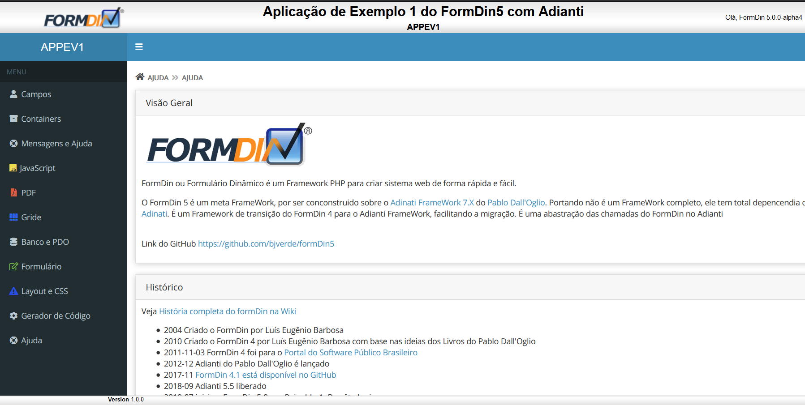
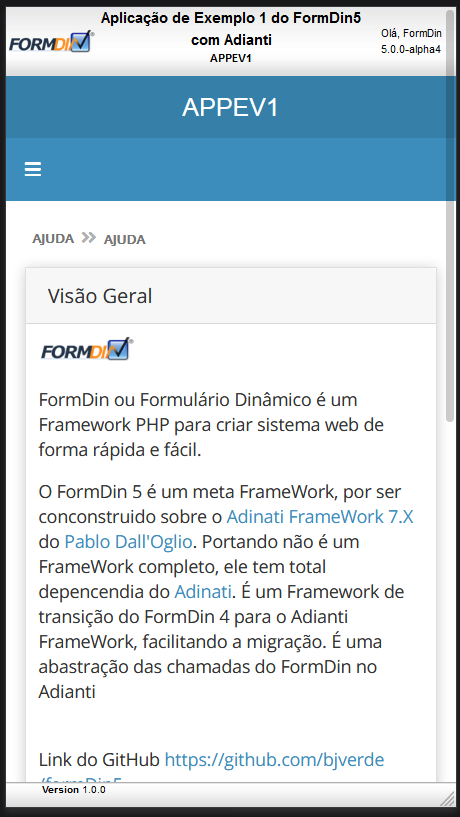

# Temas para o FrameWork Puro
Temas para apresentação do [Adianti FrameWork 7.1 ou superior](https://www.adianti.com.br/) baseado na aparecem padrão d BootStrap

* [<- voltar para lista de temas BootStrap](../framework_puro.md)
* [<- voltar para index](../../README.md)


# theme_formdinv
Tema baseado no [theme3_v5](../bootstrap_theme3_v5.md) para o Template. *Quais são as diferenças do theme 3 do Adianti ?*. Veja abaixo:

## Quais são as diferenças do theme 3 do Adianti ?.
* retirada do `maximum-scale=1, user-scalable=no` da `viewport` no arquivo layout.html. Sem esse parâmetro no celular o usuário consegue fazer o movimento de pinça para aumentar ou diminuir o zoom , o que aumenta acessebilidade para os usuários.
* Inclusão dos arquivos das fontes MaterialIcons e source-code-pro assim não precisa de internet para baixar as fontes.
* Inclusão do nome do sistema de forma customizada no `application.ini`.
* Inclusão da versão do sistema de forma customizada no `application.ini`.
* Title do HEAD alterado conforme novos parametos `head_title` e `version` no `application.ini`.
* Arquivo de `libraries.html` conforme Adianti 7.1
* Arquivo favicon.png
* Arquivo de `layout.html` alterado removendo `layout-boxed` para ocupar toda area


## Telas e suas alterações
Visão Desktop


Visão no celular Desktop


[Vejas imagens do Themve3_v4, para ver outras mudanças](bootstrap_theme3_v4.md#theme3_v4)

## Origem das fontes MaterialIcons
* MaterialIcons - https://github.com/google/material-design-icons/releases
* source-code-pro - https://github.com/adobe-fonts/source-code-pro
* Artigo do StackOverFlow que ajudou corrigir os temas - https://stackoverflow.com/questions/37270835/how-to-host-material-icons-offline


## Para usar 

### Etapa 00

1. copiar a pasta `<CLONE_GIT>/framework_puro/theme_formdinv` para `<SISTEMA>/app/templates`

### Etapa 01 
Editar o arquivo `<SISTEMA>/app/config/application.ini`

1. Alterar para `theme = theme_formdinv`
1. incluindo as informações abaixo : 
```ini
[system]
version = 1.0.0 ;versão do sistema
head_title = Nome do meu sistema
logo-lg = Exemplo
logo-mini = /images/icon.png
logo-link-class = 'index.php?class=SystemAboutView'
login-link = http://wwww.meusite.com.br
```
### Etapa 02
Edite o arquivo `<SISTEMA>/app/lib/menu/AdiantiMenuBuilder.php` incluido as linhas abaixo:
```php
            case 'theme_formdinv':
                ob_start();
                $xml = new SimpleXMLElement(file_get_contents($file));
                $menu = new TMenu($xml, null, 1, 'treeview-menu', 'treeview', '');
                $menu->class = 'sidebar-menu';
                $menu->id    = 'side-menu';
                $menu->show();
                $menu_string = ob_get_clean();
                return $menu_string;
            break;
```

### Etapa 03
Edite o arquivo `<SISTEMA>/index.php` incluido as linhas abaixo:
```php
$system_version = $ini['system']['version'];
$head_title  = $ini['system']['head_title'].' - v'.$system_version;
$content     = str_replace('{head_title}', $head_title, $content);
$content     = str_replace('{system_version}', $system_version, $content);
$content     = str_replace('{logo-mini}', $ini['general']['application'], $content);
$content     = str_replace('{logo-lg}', $ini['system']['logo-lg'], $content);
$content     = str_replace('{logo-link-class}', $ini['system']['logo-link-class'], $content);
```