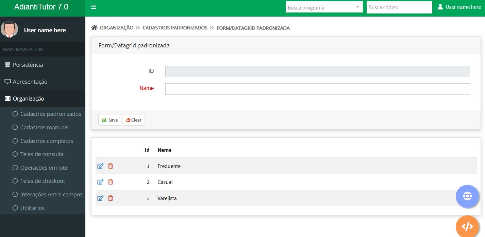

# Temas para o FremeWork Puro
Temas para apresentação do [Adianti FrameWork 7.0](https://www.adianti.com.br/)

[adminbs5_v2](template/adminbs5_v2.md), tema padrão do Adianti 8.0.0 com melhorias

Temas para apresentação do template [Adianti FrameWork 7.6.0](template_ad76.md) 

## Bootstrap
Temas baseado na aparecem padrão do Bootstrap
* [Boostrap Theme_formdin](framework_puro/bootstrap_theme_formdin.md), tema com menu horizontal e baseado no tema classico do FormDin 4
* [Boostrap Theme_formdinv](framework_puro/bootstrap_theme_formdinv.md), tema com menu vertical e baseado no tema classico do FormDin 4
* [theme3_v5](framework_puro/bootstrap_theme3_v5.md)  para Adianti 7.6.0

Ideia geral um Tema BootStrap

## Material
Temas baseado na aparencia Material da google, são temas Bootstrap porém com o lock en feel diferente.

* [theme4_v5](framework_puro/bootstrap_theme4_v5.md)  para Adianti 7.6.0