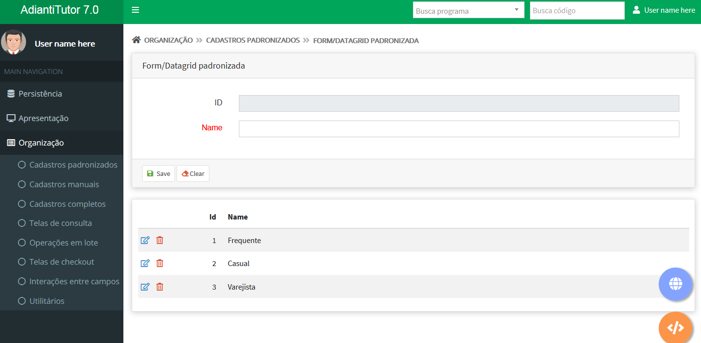
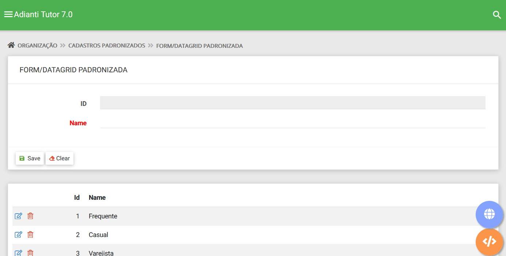

# Temas para o Template
Temas para apresentação do template [Adianti FrameWork 7.1](https://www.adianti.com.br/)

# Bootstrap
Temas baseado na aparecem padrão do Bootstrap

* [Boostrap Theme3_v4](template/bootstrap_theme3_v4.md)

# Material
Temas baseado na aparecem Material da google, são temas Bootstrap porém com o lock en feel diferente.

* [Boostrap Theme4_v4](template/material_theme4_v4.md)

