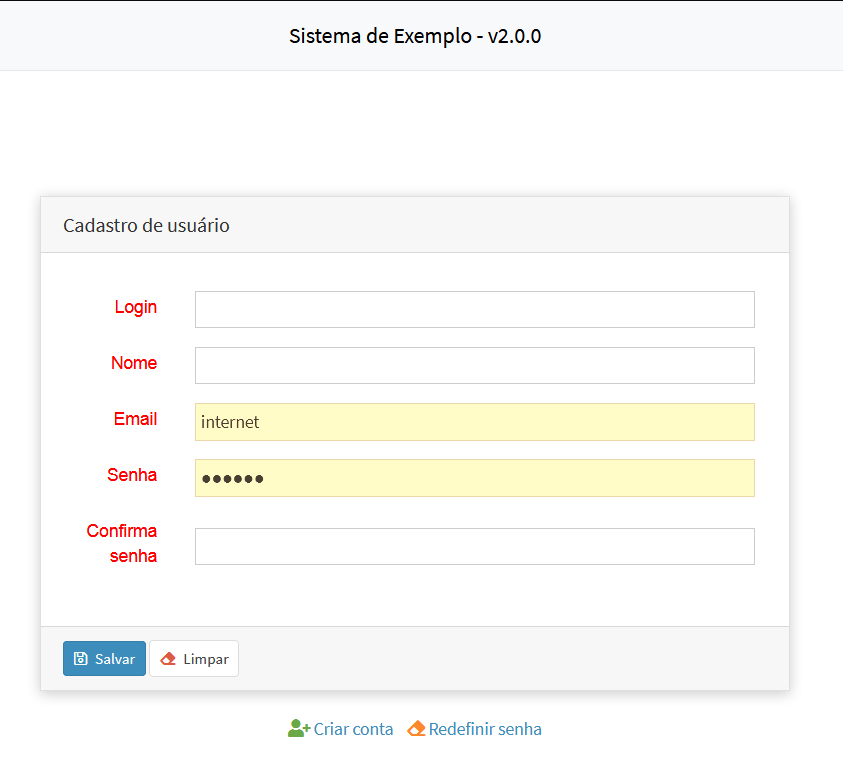

# Temas para o Template
* [<- voltar para lista de temas BootStrap](../template.md)
* [<- voltar para index](../../README.md)


Temas para apresentação do template [Adianti FrameWork 8.0.0](https://adiantiframework.com.br/)

*Quais são as diferenças do tema padrão ?*.

# Permitindo ZOOM
Removendo `maximum-scale=1, user-scalable=no` - Sem esse parâmetro no celular o usuário consegue fazer o movimento de pinça para aumentar ou diminuir o zoom, o que aumenta acessebilidade para os usuários.
1. Arquivo: `layout-basic.html`
1. Arquivo: `layout.html`
1. Arquivo: `login.html`
1. Arquivo: `public.html`

1. [Houver grid amarelo](https://github.com/bjverde/adianti-theme/issues/23)
1. [Campo com resize](https://github.com/bjverde/adianti-theme/issues/22)


## Telas e suas alterações
Alterações na tela de login


Alterações nas telas publicas


Alterações nas telas Principais


Mostrando o numero da versão, no rodape


## Origem das fontes MaterialIcons
* MaterialIcons - https://github.com/google/material-design-icons/releases
* source-code-pro - https://github.com/adobe-fonts/source-code-pro
* Artigo do StackOverFlow que ajudou corrigir os temas - https://stackoverflow.com/questions/37270835/how-to-host-material-icons-offline


## Para usar o theme3_v5
1. copie a pasta pasta `theme3_v5` dentro de framework_puro cole em `<SISTEMA>/app/templates`
1. Excute as partes abaixo

### Parte 01 
Editar o arquivo `<SISTEMA>/app/config/application.ini`

#### alterar o tema padrão
altere o valor `theme = <NOME ATUAL>` para `theme = theme3_v5`

#### incluindo seção system 
Incluir uma nova seção com as informações abaixo

```ini
[system]
system_version = 2.0.0
head_title = Sistema de Exemplo
logo-lg = Exemplo
logo-link-class = 'SystemAboutView'
login-link = http://wwww.meusite.com.br
```

### Parte 02
Edite o arquivo `<SISTEMA>/app/lib/menu/AdiantiMenuBuilder.php` alterando nas linhas
```php
            case 'theme3':
                ob_start();
                $callback = array('SystemPermission', 'checkPermission');
                $xml = new SimpleXMLElement(file_get_contents($file));
```

incluido theme3_v5 logo abaixo theme3, ficando como o exemplo abaixo
```php
            case 'theme3':
            case 'theme3_v5':
                ob_start();
                $callback = array('SystemPermission', 'checkPermission');
                $xml = new SimpleXMLElement(file_get_contents($file));
```

### Etapa 03
Edite o arquivo `<SISTEMA>/index.php` incluido as linhas abaixo:
```php
if ( TSession::getValue('logged') ){
    $content = file_get_contents("app/templates/{$theme}/layout.html");
    $menu    = AdiantiMenuBuilder::parse('menu.xml', $theme);
    $content = str_replace('{MENU}', $menu, $content);

    //Novas linhas para Theme3_v5
    $system_version = $ini['system']['system_version'];
    $head_title  = $ini['system']['head_title'].' - v'.$system_version;
    $content     = str_replace('{head_title}', $head_title, $content);
    $content     = str_replace('{system_version}', $system_version, $content);
    $content     = str_replace('{logo-mini}', $ini['general']['application'], $content);
    $content     = str_replace('{logo-lg}', $ini['system']['logo-lg'], $content);
    $content     = str_replace('{logo-link-class}', $ini['system']['logo-link-class'], $content);
}else{
    if (isset($ini['general']['public_view']) && $ini['general']['public_view'] == '1')
    {
        $content = file_get_contents("app/templates/{$theme}/public.html");
        $menu    = AdiantiMenuBuilder::parse('menu-public.xml', $theme);
        $content = str_replace('{MENU}', $menu, $content);

        //Novas linhas para Theme3_v5
        $system_version = $ini['system']['system_version'];
        $head_title  = $ini['system']['head_title'].' - v'.$system_version;
        $content     = str_replace('{head_title}', $head_title, $content);
        $content     = str_replace('{system_version}', $system_version, $content);
        $content     = str_replace('{logo-mini}', $ini['general']['application'], $content);
        $content     = str_replace('{logo-lg}', $ini['system']['logo-lg'], $content);
        $content     = str_replace('{logo-link-class}', $ini['system']['logo-link-class'], $content);
    }else{
        $content = file_get_contents("app/templates/{$theme}/login.html");

        //Novas linhas para Theme3_v5
        $system_version = $ini['system']['system_version'];
        $head_title  = $ini['system']['head_title'].' - v'.$system_version;
        $content     = str_replace('{head_title}', $head_title, $content);
        $content     = str_replace('{login-link}', $ini['system']['login-link'], $content);
    }
}
```
