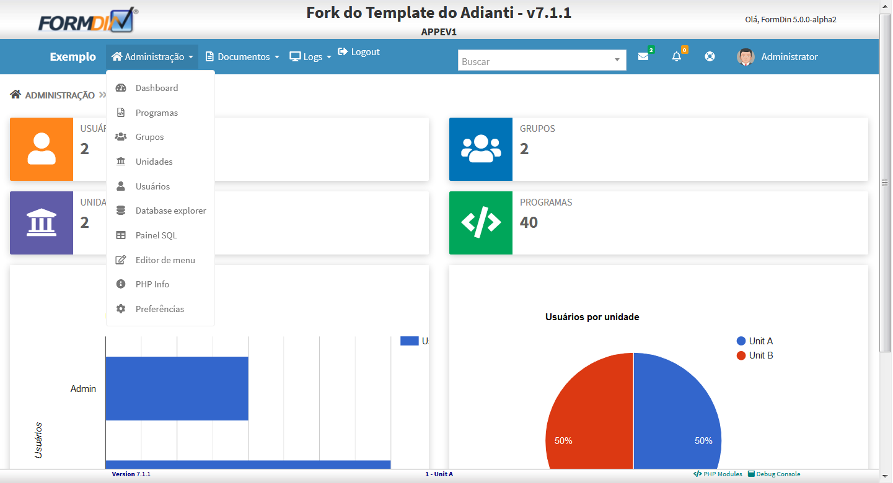
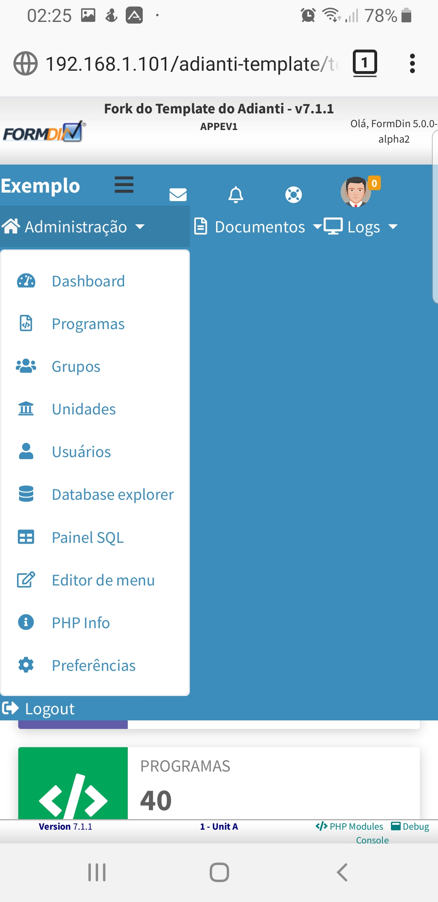

# Temas para o Template
Temas para apresentação do template [Adianti FrameWork 7.2.2](https://www.adianti.com.br/) baseado na aparecem padrão d BootStrap. Provalemente irá funcionar nas versões 7.0 e 7.1.

* [<- voltar para lista de temas BootStrap](../template.md)
* [<- voltar para index](../../README.md)


# h_formdin2
Tema baseado [Fcortez](template/bootstrap_theme_fcortez.md) é no [Formdin](template/bootstrap_theme_formdin.md) que são baseados no [theme3_h](../bootstrap_theme3_h.md) para o Template. *Quais são as diferenças do theme 3 do Adianti ?*. Veja abaixo:

1. Layout com barra de menus vertical
1. retirada do `maximum-scale=1, user-scalable=no` da `viewport` no arquivo layout.html. Sem esse parâmetro no celular o usuário NÃO consegue fazer o movimento de pinça para aumentar ou diminuir o zoom , o que aumenta acessebilidade para os usuários.
1. Mais parametos customizaveis `application.ini` tais como: Title do HEAD, versão dos sistema
1. Arquivo favicon.png no `/theme_formdin/img/favicon.png`
1. Inclusão do link de login nas telas iniciais
1. Inclusão de um cabeçalho
1. alteração do radapé


## Telas e suas alterações
Visão Desktop


Visão no celular Desktop


[Vejas imagens do Themve3_v4, para ver outras mudanças](bootstrap_theme3_v4.md#theme3_v4)

## Origem das fontes MaterialIcons
* MaterialIcons - https://github.com/google/material-design-icons/releases
* source-code-pro - https://github.com/adobe-fonts/source-code-pro
* Artigo do StackOverFlow que ajudou corrigir os temas - https://stackoverflow.com/questions/37270835/how-to-host-material-icons-offline


## Para usar 

### Etapa 01 
Editar o arquivo `<SISTEMA>/app/config/application.ini`

1. Alterar para `theme = h_formdin2`
1. incluindo as informações abaixo : 
```ini
[system]
version = 2.0.0
head_title = Fork do Template do Adianti
logo-lg = Exemplo
logo-mini = /images/icon.png
logo-link-class = 'index.php?class=SystemAboutView'
login-link = http://wwww.meusite.com.br
```

### Etapa 02
Edite o arquivo `<SISTEMA>/app/lib/menu/AdiantiMenuBuilder.php` incluido as linhas abaixo:
```php
            case 'h_formdin2':
                ob_start();
                $callback = array('SystemPermission', 'checkPermission');
                $menu = THMenuBar::newFromXML($file, $callback);
                $menu->show();
                $menu_string = ob_get_clean();
                return $menu_string;
            break;
```

### Etapa 03
Edite o arquivo `<SISTEMA>/index.php` incluido as linhas abaixo:
```php
if ( TSession::getValue('logged') ){
    $content = file_get_contents("app/templates/{$theme}/layout.html");
    $menu    = AdiantiMenuBuilder::parse('menu.xml', $theme);
    $content = str_replace('{MENU}', $menu, $content);

    //Novas linhas para theme_formdin
    $system_version = $ini['system']['version'];
    $head_title  = $ini['system']['head_title'].' - v'.$system_version;
    $content     = str_replace('{head_title}', $head_title, $content);
    $content     = str_replace('{system_version}', $system_version, $content);
    $content     = str_replace('{logo-mini}', $ini['general']['application'], $content);
    $content     = str_replace('{logo-lg}', $ini['system']['logo-lg'], $content);
    $content     = str_replace('{logo-link-class}', $ini['system']['logo-link-class'], $content);
}else{
    if (isset($ini['general']['public_view']) && $ini['general']['public_view'] == '1')
    {
        $content = file_get_contents("app/templates/{$theme}/public.html");
        $menu    = AdiantiMenuBuilder::parse('menu-public.xml', $theme);
        $content = str_replace('{MENU}', $menu, $content);

        //Novas linhas para theme_formdin
        $system_version = $ini['system']['version'];
        $head_title  = $ini['system']['head_title'].' - v'.$system_version;
        $content     = str_replace('{head_title}', $head_title, $content);
        $content     = str_replace('{system_version}', $system_version, $content);
        $content     = str_replace('{logo-mini}', $ini['general']['application'], $content);
        $content     = str_replace('{logo-lg}', $ini['system']['logo-lg'], $content);
        $content     = str_replace('{logo-link-class}', $ini['system']['logo-link-class'], $content);
    }else{
        $content = file_get_contents("app/templates/{$theme}/login.html");

        //Novas linhas para theme_formdin
        $system_version = $ini['system']['version'];
        $head_title  = $ini['system']['head_title'].' - v'.$system_version;
        $content     = str_replace('{head_title}', $head_title, $content);
        $content     = str_replace('{login-link}', $ini['system']['login-link'], $content);
    }
}
```

### Etapa 04
Copiar toda pasta app/templates/theme3 do seu sistema com adianti template para app/templates/theme_fcortez

### Etapa 05

Copiar as pastas da pasta do tema, subistuitindo o conteudo no sistema. 