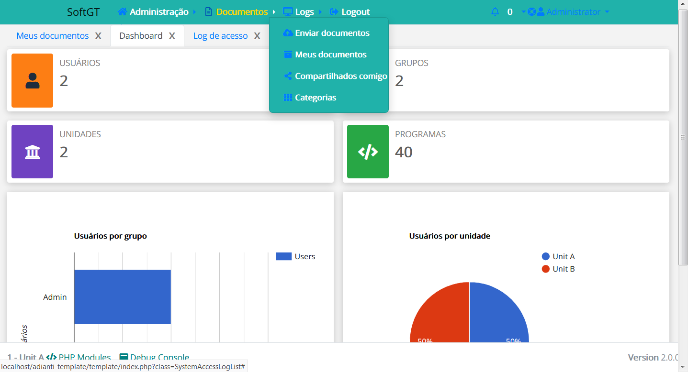

# Temas para o Template
Temas para apresentação do template [Adianti FrameWork 7.1](https://www.adianti.com.br/) baseado na aparecem padrão d BootStrap

* [<- voltar para lista de temas BootStrap](../template.md)
* [<- voltar para index](../../README.md)


# Theme1_softgt

Tema criado pelo AgostinhoBarbosa da SoftGt
https://github.com/AgostinhoBarbosa


1. retirada do `maximum-scale=1, user-scalable=no` da `viewport` no arquivo layout.html. Sem esse parâmetro no celular o usuário consegue fazer o movimento de pinça para aumentar ou diminuir o zoom , o que aumenta acessebilidade para os usuários.
1. Janelas abrindo em Abas. 
1. Inclusão do nome da empresa no arquivo `application.ini`.
1. **NÃO** funciona muito bem no celular


## Telas e suas alterações
Alterações na tela de login



## Para usar 

### Etapa 01 
Editar o arquivo `<SISTEMA>/app/config/application.ini`

1. Alterar para `theme = theme1_softgt`
1. incluindo a variável : 
```ini
empresa = "SoftGT Informática"
```
### Etapa 02
Edite o arquivo `<SISTEMA>/app/lib/menu/AdiantiMenuBuilder.php` incluido as linhas abaixo:
```php
            case 'theme1_softg':
                $callback = array('SystemPermission', 'checkPermission');
                $xml = new SimpleXMLElement(file_get_contents($file));
                $menu = new TMenu($xml, $callback, 1, 'dropdown-menu');
                $menu->class = 'sidebar-menu';
                $menu->id = 'side-menu';
                $menu->show();
                $menu_string = ob_get_clean();

                $menu_string = str_replace('<ul class="sidebar-menu" id="side-menu">', '', $menu_string);
                $menu_string = substr($menu_string, 0, -6);

                return $menu_string;
            break;
```