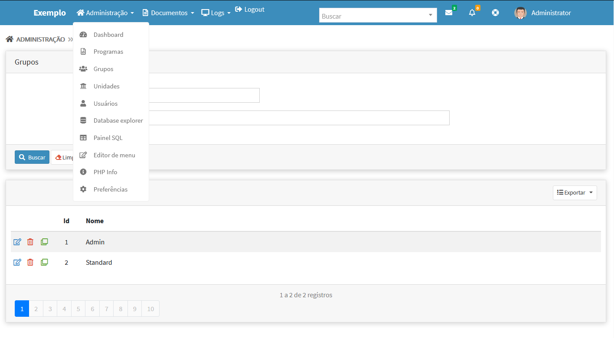

# Temas para o Template
Temas para apresentação do template [Adianti FrameWork 7.1](https://www.adianti.com.br/) baseado na aparecem padrão d BootStrap

* [<- voltar para lista de temas BootStrap](../template.md)
* [<- voltar para index](../../README.md)


# Theme3_v4
Tema baseado no [theme3_v4](../framework_puro.md#theme3_v4) para o FrameWork puro. *Quais são as diferenças do theme 3 do Adianti ?*. Veja abaixo:

1. retirada do `maximum-scale=1, user-scalable=no` da `viewport` no arquivo layout.html. Sem esse parâmetro no celular o usuário consegue fazer o movimento de pinça para aumentar ou diminuir o zoom , o que aumenta acessebilidade para os usuários.
1. Inclusão dos arquivos das fontes MaterialIcons e source-code-pro assim não precisa de internet para baixar as fontes. 
1. Inclusão do nome do sistema de forma customizada no `application.ini`.
1. Inclusão da versão do sistema de forma customizada no `application.ini`.
1. Title do HEAD alterado conforme novos parametos `head_title` e `version` no `application.ini`
1. Arquivo favicon.png no `/theme3_h/img/favicon.png`
1. Inclusão do link de login nas telas iniciais
1. **Menu na horizontal**


## Telas e suas alterações
Alterações na tela de login


[Vejas imagens do Themve3_v4, para ver outras mudanças](bootstrap_theme3_v4.md#theme3_v4)


## Origem das fontes MaterialIcons
* MaterialIcons - https://github.com/google/material-design-icons/releases
* source-code-pro - https://github.com/adobe-fonts/source-code-pro
* Artigo do StackOverFlow que ajudou corrigir os temas - https://stackoverflow.com/questions/37270835/how-to-host-material-icons-offline


## Para usar 

### Etapa 01 
Editar o arquivo `<SISTEMA>/app/config/application.ini`

1. Alterar para `theme = theme3_h`
1. incluindo as informações abaixo : 
```ini
[system]
version = 2.0.0
head_title = Fork do Template do Adianti
logo-lg = Exemplo
logo-mini = /images/icon.png
logo-link-class = 'index.php?class=SystemAboutView'
login-link = http://wwww.meusite.com.br
```
### Etapa 02
Edite o arquivo `<SISTEMA>/app/lib/menu/AdiantiMenuBuilder.php` incluido as linhas abaixo:
```php
            case 'theme3_h':
                ob_start();
                $callback = array('SystemPermission', 'checkPermission');
                $xml = new SimpleXMLElement(file_get_contents($file));
                $menu = new TMenu($xml, $callback, 1,'dropdown-menu','nav-item dropdown','nav-link dropdown-toggle');
                $menu->id    = 'main-menu-top';
                $menu->show();
                $menu_string = ob_get_clean();
                
                $menu_string = str_replace('class="dropdown-menu level-1" id="main-menu-top"', 'class="nav navbar-nav" id="main-menu-top"', $menu_string);
                //$menu_string = str_replace('<a href="', '<a class="dropdown-item" href="', $menu_string);
                return $menu_string;
            break;
```

### Etapa 03
Edite o arquivo `<SISTEMA>/index.php` incluido as linhas abaixo:
```php
if ( TSession::getValue('logged') ){
    $content = file_get_contents("app/templates/{$theme}/layout.html");
    $menu    = AdiantiMenuBuilder::parse('menu.xml', $theme);
    $content = str_replace('{MENU}', $menu, $content);

    //Novas linhas para theme3_h
    $system_version = $ini['system']['version'];
    $head_title  = $ini['system']['head_title'].' - v'.$system_version;
    $content     = str_replace('{head_title}', $head_title, $content);
    $content     = str_replace('{system_version}', $system_version, $content);
    $content     = str_replace('{logo-mini}', $ini['general']['application'], $content);
    $content     = str_replace('{logo-lg}', $ini['system']['logo-lg'], $content);
    $content     = str_replace('{logo-link-class}', $ini['system']['logo-link-class'], $content);
}else{
    if (isset($ini['general']['public_view']) && $ini['general']['public_view'] == '1')
    {
        $content = file_get_contents("app/templates/{$theme}/public.html");
        $menu    = AdiantiMenuBuilder::parse('menu-public.xml', $theme);
        $content = str_replace('{MENU}', $menu, $content);

        //Novas linhas para theme3_h
        $system_version = $ini['system']['version'];
        $head_title  = $ini['system']['head_title'].' - v'.$system_version;
        $content     = str_replace('{head_title}', $head_title, $content);
        $content     = str_replace('{system_version}', $system_version, $content);
        $content     = str_replace('{logo-mini}', $ini['general']['application'], $content);
        $content     = str_replace('{logo-lg}', $ini['system']['logo-lg'], $content);
        $content     = str_replace('{logo-link-class}', $ini['system']['logo-link-class'], $content);
    }else{
        $content = file_get_contents("app/templates/{$theme}/login.html");

        //Novas linhas para theme3_h
        $system_version = $ini['system']['version'];
        $head_title  = $ini['system']['head_title'].' - v'.$system_version;
        $content     = str_replace('{head_title}', $head_title, $content);
        $content     = str_replace('{login-link}', $ini['system']['login-link'], $content);
    }
}
```