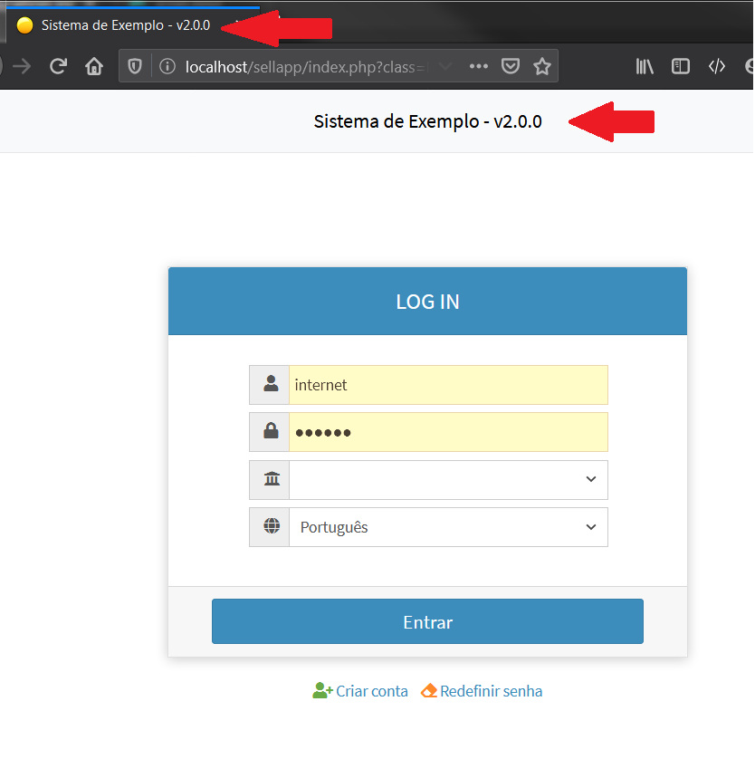
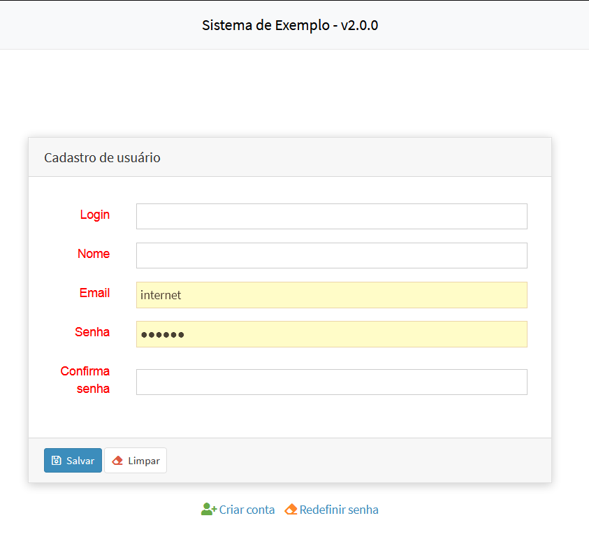
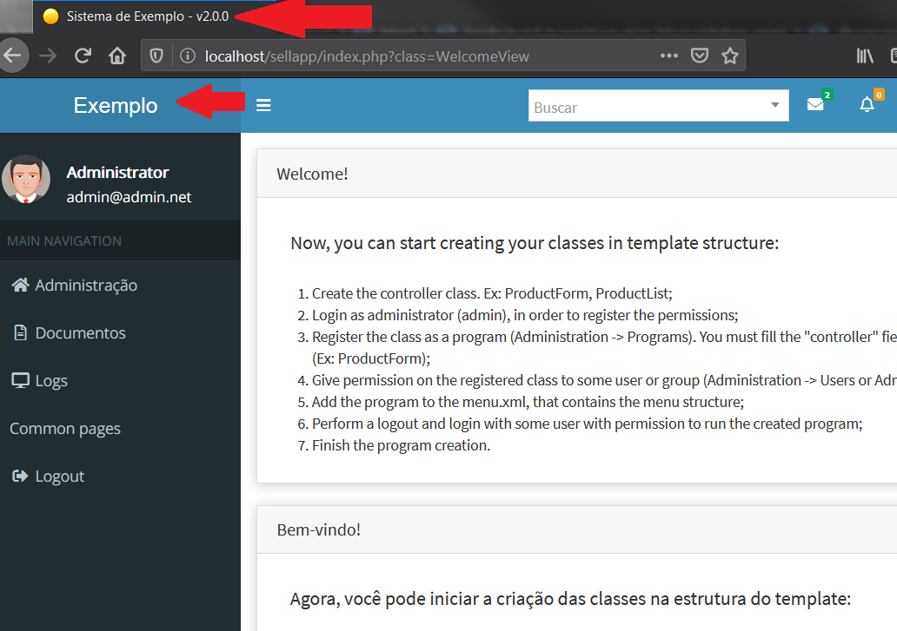
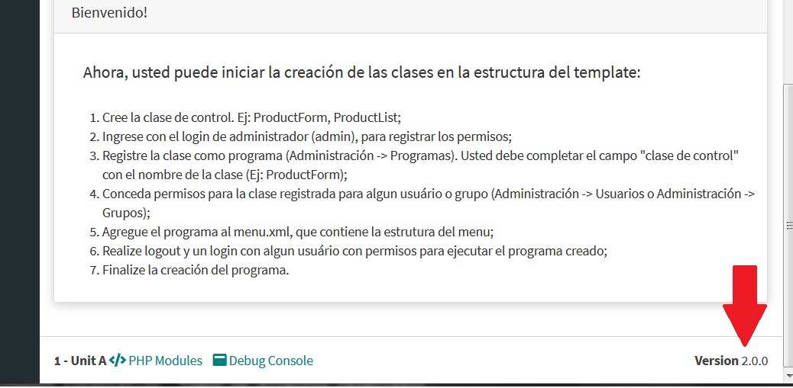

# Temas para o Template
Temas para apresentação do template [Adianti FrameWork 7.5.1](https://www.adianti.com.br/) baseado na aparecem padrão d BootStrap

* [<- voltar para lista de temas BootStrap](../template.md)
* [<- voltar para index](../../README.md)


# Theme3_v5
Tema baseado no [theme3_v5](../framework_puro.md#Bootstrap) para o FrameWork puro.

*Quais são as diferenças do theme 3 do Adianti ?*.
1. Inclusão dos arquivos das fontes MaterialIcons e source-code-pro assim não precisa de internet para baixar as fontes. 
1. Arquivo: `layout.html` - retirada do `maximum-scale=1, user-scalable=no` da `viewport`. Sem esse parâmetro no celular o usuário consegue fazer o movimento de pinça para aumentar ou diminuir o zoom, o que aumenta acessebilidade para os usuários.
1. Arquivo: `layout.html` - Inclusão do nome do sistema de forma customizada `{logo-lg}` ou `{logo-mini}` no `application.ini`.
1. Arquivo: `layout.html` - Inclusão da versão do sistema `{system_version}` de forma customizada no `application.ini`.
1. Arquivo: `layout.html` - Title do HEAD alterado conforme novos parametos `{head_title}` e `{system_version}` no `application.ini`.
1. Arquivo: `layout.html` - Inclusão favicon.png
1. Arquivo: `libraries.html` - conforme Adianti 7.5.1b
1. Arquivo: `login.html` - Inclusão do nome do sistema de forma customizada `{logo-lg}` ou `{logo-mini}` no `application.ini`.
1. Arquivo: `login.html` - Title do HEAD alterado conforme novos parametos `{head_title}` e `{system_version}` no `application.ini`.
1. Arquivo: `public.html` - Inclusão do nome do sistema de forma customizada `{logo-lg}` ou `{logo-mini}` no `application.ini`.
1. Arquivo: `public.html` - Title do HEAD alterado conforme novos parametos `{head_title}` e `{system_version}` no `application.ini`.


## Telas e suas alterações
Alterações na tela de login


Alterações nas telas publicas


Alterações nas telas Principais


Mostrando o numero da versão, no rodape



## Origem das fontes MaterialIcons
* MaterialIcons - https://github.com/google/material-design-icons/releases
* source-code-pro - https://github.com/adobe-fonts/source-code-pro
* Artigo do StackOverFlow que ajudou corrigir os temas - https://stackoverflow.com/questions/37270835/how-to-host-material-icons-offline


## Para usar 

### Etapa 01 
Editar o arquivo `<SISTEMA>/app/config/application.ini` incluindo as informações abaixo : 

```ini
[system]
version = 2.0.0
head_title = Fork do Template do Adianti
logo-lg = Exemplo
logo-mini = /images/icon.png
logo-link-class = 'index.php?class=SystemAboutView'
login-link = http://wwww.meusite.com.br
```

### Etapa 02
Edite o arquivo `<SISTEMA>/app/lib/menu/AdiantiMenuBuilder.php` incluido as linhas abaixo:
```php
            case 'theme3_v5':
                ob_start();
                $callback = array('SystemPermission', 'checkPermission');
                $xml = new SimpleXMLElement(file_get_contents($file));
                $menu = new TMenu($xml, $callback, 1, 'treeview-menu', 'treeview', '');
                $menu->class = 'sidebar-menu';
                $menu->id    = 'side-menu';
                $menu->show();
                $menu_string = ob_get_clean();
                return $menu_string;
            break;
```

### Etapa 03
Edite o arquivo `<SISTEMA>/index.php` incluido as linhas abaixo:
```php
if ( TSession::getValue('logged') ){
    $content = file_get_contents("app/templates/{$theme}/layout.html");
    $menu    = AdiantiMenuBuilder::parse('menu.xml', $theme);
    $content = str_replace('{MENU}', $menu, $content);

    //Novas linhas para Theme3_v4
    $system_version = $ini['system']['version'];
    $head_title  = $ini['system']['head_title'].' - v'.$system_version;
    $content     = str_replace('{head_title}', $head_title, $content);
    $content     = str_replace('{system_version}', $system_version, $content);
    $content     = str_replace('{logo-mini}', $ini['general']['application'], $content);
    $content     = str_replace('{logo-lg}', $ini['system']['logo-lg'], $content);
    $content     = str_replace('{logo-link-class}', $ini['system']['logo-link-class'], $content);
}else{
    if (isset($ini['general']['public_view']) && $ini['general']['public_view'] == '1')
    {
        $content = file_get_contents("app/templates/{$theme}/public.html");
        $menu    = AdiantiMenuBuilder::parse('menu-public.xml', $theme);
        $content = str_replace('{MENU}', $menu, $content);

        //Novas linhas para Theme3_v4
        $system_version = $ini['system']['version'];
        $head_title  = $ini['system']['head_title'].' - v'.$system_version;
        $content     = str_replace('{head_title}', $head_title, $content);
        $content     = str_replace('{system_version}', $system_version, $content);
        $content     = str_replace('{logo-mini}', $ini['general']['application'], $content);
        $content     = str_replace('{logo-lg}', $ini['system']['logo-lg'], $content);
        $content     = str_replace('{logo-link-class}', $ini['system']['logo-link-class'], $content);
    }else{
        $content = file_get_contents("app/templates/{$theme}/login.html");

        //Novas linhas para Theme3_v4
        $system_version = $ini['system']['version'];
        $head_title  = $ini['system']['head_title'].' - v'.$system_version;
        $content     = str_replace('{head_title}', $head_title, $content);
        $content     = str_replace('{login-link}', $ini['system']['login-link'], $content);
    }
}
```