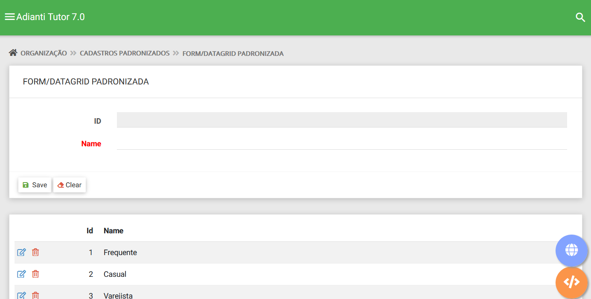

# Temas para o Template
* [<- voltar para index](../README.md)

Temas para apresentação do template [Adianti FrameWork 7.6.0](https://www.adianti.com.br/)

## Bootstrap
Temas baseado na aparecem padrão do Bootstrap

Ideia geral um Tema BootStrap

### Menu Vertical

* [Boostrap Theme3_v5](template/bootstrap_theme3_v5.md), pequenas melhorias no tema padrão para Adianti 7.6.0
* Boostrap Theme3-adminlte3, pequenas melhorias no tema padrão para Adianti 7.3.0

### Menu Horizontal
* [Boostrap Theme1_softgt](template/bootstrap_them1_softgt.md), criado pelo [AgostinhoBarbosa da SoftGt](https://github.com/AgostinhoBarbosa) para Adianti 7.0.1
* [Boostrap Theme_formdin](template/bootstrap_theme_formdin.md), tema com menu horizontal e baseado no tema classico do FormDin 4 para Adianti 7.0.1
* [Boostrap Theme3_h](template/bootstrap_theme3_h.md), tema com menu horizontal para Adianti 7.5.0
* [Boostrap Theme_fcortez](template/bootstrap_theme_fcortez.md), tema com menu horizontal criado por [Felipe Cortez](https://github.com/cortezfelipe/template-horizontal)
* [Boostrap h_formdin2](template/bootstrap_h_formdin2.md), tema com menu horizontal e baseado: no tema classico do FormDin 4 e [Fcortez](template/bootstrap_theme_fcortez.md)

## Material
Temas baseado na aparecem Material da google, são temas Bootstrap porém com o lock en feel diferente.

* [Boostrap Theme4_v5](template/material_theme4_v5.md) para Adianti 7.6.0

Ideia geral um tema Material
